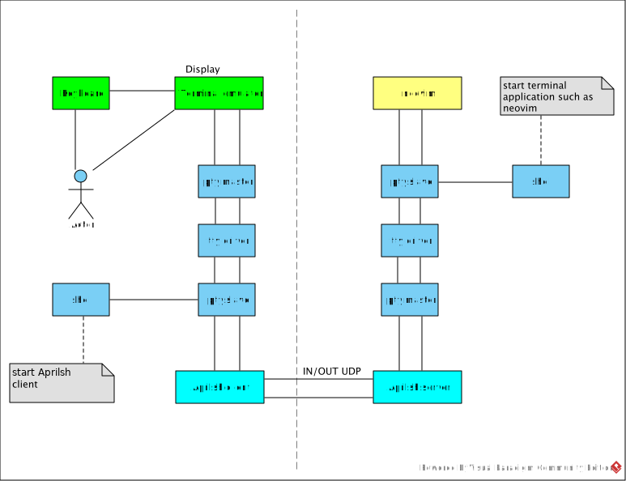

Aprilsh: remote shell support intermittent or mobile network. inspired by [mosh](https://mosh.org/) and [zutty](https://github.com/tomscii/zutty). aprilsh is a remote shell based on UDP, authenticate user via openssh.

## Installation

### Reqirement
- [open-ssh](https://www.openssh.com/) is a must reqirement, sshd is required to perform user authentication.
- [locale support](https://git.adelielinux.org/adelie/musl-locales/-/wikis/home) is a must reqirement.
- [ncurses and terminfo](https://invisible-island.net/ncurses/) is a must requirement.
- [systmd](https://systemd.io/) is reuired by redhat linux family (fedora, centos, redhat).
- [openrc](https://github.com/OpenRC/openrc) is required by alpine.
- [utmps](https://skarnet.org/software/utmps/) is reuired by alpine
- [logrotate](https://github.com/logrotate/logrotate) is reuired by alpine.

if you perfer to build aprilsh manually, please refer to [this document](doc/install-alpine.md)

### Alpine linux
Before start apshd, you need to make sure you can ssh login to the target server, please refer to [this doc](doc/ssh-openrc.md) to setup a ssh enabled docker container.

Note: aprilsh is still waiting for aports approval. For now please use the following private repository. The private repository only provide `x86_64` packages. Refer to [build doc](doc/build.md) to know how to build apk packages and private repositories.
```sh
# add public key
wget -P /etc/apk/keys/ https://ericwq.github.io/alpine/packager-665145ad.rsa.pub
# add private repository
echo "https://ericwq.github.io/alpine/v3.19/testing" >> /etc/apk/repositories
# update repositories metadata
apk update
# install client and server
apk add aprilsh
```
Now you can ssh login to the server and the aprilsh is installed, it's time to start apshd server and login with apsh.
```sh
# start apshd server
rc-service apshd start
# apsh login to server
apsh -m 100 eric@localhost:8022
# apsh login without port mapping
apsh eric@localhost

```
Note: when aports finally approve aprilsh, the above private repository will be replaced by official testing repositories. The testing repositories will provide all architecture packages.
```sh
# add testing repositories
echo "https://dl-cdn.alpinelinux.org/alpine/edge/testing" >> /etc/apk/repositories
```

### Fedora, CentOS, Redhat linux
Before start apshd, you need to make sure you can ssh login to the target server, please refer to [this doc](doc/ssh-systemd.md) to setup a ssh enabled docker container.

Note: This is a private yum/dnf repositories, it only provides `x86_64` packages. Refer to [rpms doc](https://codeberg.org/ericwq/rpms#build-rpm-packages) to understand how to build rpm packags and dnf repositories.
```sh
# import public key to rpm DB
rpm --import https://ericwq.codeberg.page/RPM-GPG-KEY-wangqi
# add new repo to dnf repository
dnf config-manager --add-repo https://ericwq.codeberg.page/aprilsh.repo
# install client and server
dnf install -y aprilsh
```
Now you can ssh login to the server, it's time to start apshd service and login with apsh.
```sh
sudo systemctl start apshd.service      # start apshd service
sudo journalctl -f -u apshd.service     # keep reading the latest apshd.service log
apsh -m 100 packager@localhost:8022     # apsh login to server
apsh packager@localhost                 # apsh login without port mapping
```
### MacOS
```sh
brew tap ericwq/utils                   # add tap to homebrew
brew install aprilsh                    # only install aprilsh client
```
Refer to [homebrew doc](https://github.com/ericwq/homebrew-utils) to know how to create homebrew package and tap.
### Validate installation
by default apshd listen on udp localhost:8100.
```txt
openrc-nvide:~# netstat -lup
Active Internet connections (only servers)
Proto Recv-Q Send-Q Local Address           Foreign Address         State       PID/Program name
udp        0      0 localhost:8100          0.0.0.0:*                           45561/apshd
openrc-nvide:~#
```
now login to the system with apsh (aprilsh client), note the `motd`(welcome message) depends on you alpine system config.
```txt
qiwang@Qi15Pro client % apsh ide@localhost
openrc-nvide:0.10.2

Lua, C/C++ and Golang Integrated Development Environment.
Powered by neovim, luals, gopls and clangd.
ide@openrc-nvide:~ $
```
if you login on two terminals, on the server, there will be two server processes serve the clients. the following shows `apshd` serve two clients. one is`:8101`, the other is ':8102'
```txt
openrc:~# netstat -lp
Active Internet connections (only servers)
Proto Recv-Q Send-Q Local Address           Foreign Address         State       PID/Program name
tcp        0      0 0.0.0.0:ssh             0.0.0.0:*               LISTEN      225/sshd [listener]
tcp        0      0 :::ssh                  :::*                    LISTEN      225/sshd [listener]
udp        0      0 localhost:8100          0.0.0.0:*                           45561/apshd
udp        0      0 :::8101                 :::*                                45647/apshd
udp        0      0 :::8102                 :::*                                45612/apshd
Active UNIX domain sockets (only servers)
Proto RefCnt Flags       Type       State         I-Node PID/Program name    Path
unix  2      [ ACC ]     STREAM     LISTENING     872486 159/s6-ipcserverd   /run/utmps/.btmpd-socket
unix  2      [ ACC ]     STREAM     LISTENING     869747 253/s6-ipcserverd   /run/utmps/.utmpd-socket
unix  2      [ ACC ]     STREAM     LISTENING     866239 281/s6-ipcserverd   /run/utmps/.wtmpd-socket
openrc-nvide:~#
```
## Motivation

[openSSH](https://www.openssh.com/) is excellent. While `mosh` provides better keystroke prediction/latency and is capable of handle WiFi/cellular mobile network roaming. But `mosh` project is not active anymore and no release [sine 2017](https://github.com/mobile-shell/mosh/issues/1115). Such a good project like `mosh` should keeps developing.

After read through `mosh` source code, I decide to rewrite it with golang. Go is my first choice because the C++ syntax is too complex. Go also has excellent support for UTF-8 and multithreaded programming. The last reason: go compiler is faster than c++ compiler.

There are several rules for this project:

- Keep the base design of `mosh`: `SSP`, UDP, keystroke prediction.
- Use 3rd party library as less as possible to keep it clean.

There are also some goals for this project:

- Full UTF-8 support, including [emoji and flag](https://unicode.org/emoji/charts/emoji-list.html) support.
- Support the terminal 24bit color.
- Upgrade to [proto3](https://developers.google.com/protocol-buffers/docs/proto3)
- Use terminfo database for better compatibility.
- Prove golang is a good choice for terminal developing.

The project name `Aprilsh` is derived from `April+sh`. This project started in shanghai April 2022, and it's a remote shell. Use the above command to add musl locales support and utmps support for alpine. Note alpine only support UTF-8 charmap.

## Architecture



- The green part is provided by the system/terminal emulator. Such as [alacritty](https://alacritty.org/) or [kitty](https://sw.kovidgoyal.net/kitty/).
- The cyan part is provided by `Aprilsh`.
- The yellow part is our target terminal application. In the above diagram it's `neovim`.
- Actually the yellow part can be any terminal based application: [emcas](https://www.gnu.org/software/emacs/), [neovim](https://neovim.io/), [htop](https://htop.dev/), etc.
- The rest part is provided by the system.

## Changelog

Ready for early acess. The missing part is prediction engine tuning. Check [here](doc/changelog.md) for history deatil.

## License

[MIT](LICENSE)
